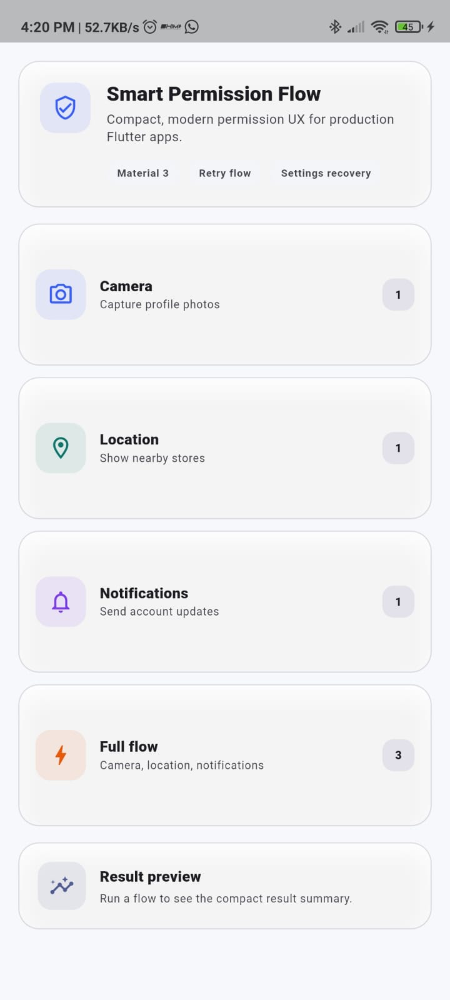
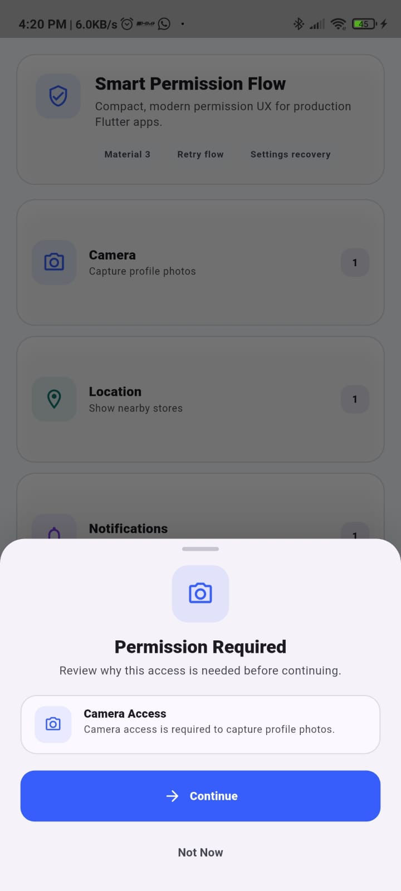
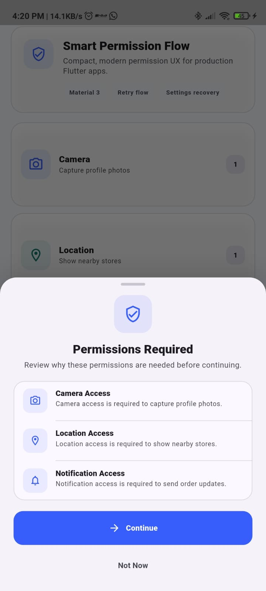
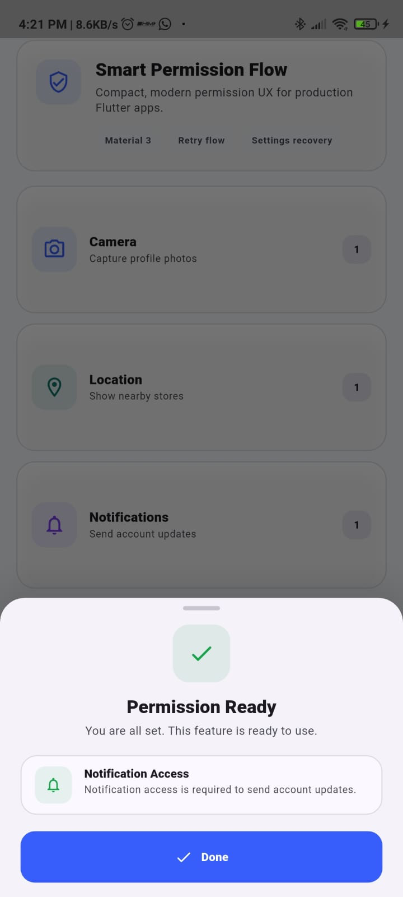
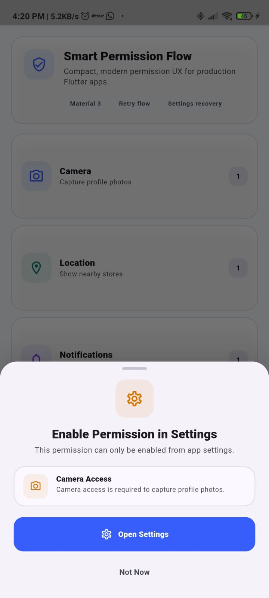

# Smart Permission Flow

`smart_permission_flow` is a Flutter package for building polished, user-friendly permission request flows on top of [`permission_handler`](https://pub.dev/packages/permission_handler).

It helps apps explain why a permission is needed, request one or more permissions, handle denied states, guide permanently denied users to settings, and keep permission UX consistent across Android and iOS.

## Features

- Beginner-friendly API for single and multi-permission flows
- Modern Material 3 bottom sheet UI
- Camera, location, microphone, notification, photos, and storage support
- Explanation UI before permission requests
- Retry flow for denied permissions
- Open Settings flow for permanently denied permissions
- Android and iOS friendly default copy
- Dark mode aware styling
- Custom button labels, colors, and sheet shape
- Fully null-safe Dart API

## Why This Package Exists

Mobile permission flows are easy to get wrong. Users need context before the system prompt appears, and apps need a reliable path for denied and permanently denied states.

`smart_permission_flow` keeps that behavior in one small package so product teams can ship a more respectful permission experience without rebuilding the same UX in every app.

## Installation

Add the package to your `pubspec.yaml`:

```yaml
dependencies:
  smart_permission_flow: ^0.0.1
```

Then run:

```sh
flutter pub get
```

## Usage

Import the package:

```dart
import 'package:smart_permission_flow/smart_permission_flow.dart';
```

### Single Permission Example

```dart
final result = await SmartPermissionFlow.request(
  context,
  permissions: [
    SmartPermission.camera(
      reason: 'Camera access is required to capture profile photos.',
    ),
  ],
);

if (result.allGranted) {
  // Continue with the camera feature.
}
```

### Multiple Permission Example

```dart
await SmartPermissionFlow.request(
  context,
  permissions: [
    SmartPermission.camera(
      reason: 'Camera access is required to upload a profile photo.',
    ),
    SmartPermission.location(
      reason: 'Location access is required to show nearby stores.',
    ),
  ],
  onAllGranted: () {
    // Continue when every requested permission is available.
  },
);
```

### Result Handling Example

```dart
final result = await SmartPermissionFlow.request(
  context,
  permissions: [
    SmartPermission.notification(
      reason: 'Notification access is required to send order updates.',
    ),
  ],
);

if (result.hasPermanentlyDeniedPermissions) {
  // The package has shown an Open Settings action.
} else if (result.hasDeniedPermissions) {
  // The user declined one or more permissions.
} else {
  // All requested permissions were granted.
}
```

### Customization Example

```dart
await SmartPermissionFlow.request(
  context,
  permissions: [
    SmartPermission.microphone(
      title: 'Voice Recording',
      reason: 'Microphone access is required to record voice notes.',
    ),
  ],
  options: SmartPermissionFlowOptions(
    continueButtonText: 'Allow Access',
    retryButtonText: 'Try Again',
    openSettingsButtonText: 'Open App Settings',
    cancelButtonText: 'Maybe Later',
    doneButtonText: 'Start Using Feature',
    primaryColor: Colors.indigo,
    successColor: Colors.green,
    warningColor: Colors.orange,
    sheetBackgroundColor: Theme.of(context).colorScheme.surface,
    borderRadius: BorderRadius.vertical(top: Radius.circular(36)),
    primaryButtonStyle: FilledButton.styleFrom(
      minimumSize: const Size.fromHeight(56),
      shape: RoundedRectangleBorder(
        borderRadius: BorderRadius.circular(18),
      ),
    ),
    titleTextStyle: Theme.of(context).textTheme.headlineSmall?.copyWith(
      fontWeight: FontWeight.w900,
    ),
  ),
);
```

## Android Setup

Add only the permissions your app requests to `android/app/src/main/AndroidManifest.xml`.

```xml
<uses-permission android:name="android.permission.CAMERA" />
<uses-permission android:name="android.permission.ACCESS_FINE_LOCATION" />
<uses-permission android:name="android.permission.ACCESS_COARSE_LOCATION" />
<uses-permission android:name="android.permission.RECORD_AUDIO" />
<uses-permission android:name="android.permission.POST_NOTIFICATIONS" />
<uses-permission android:name="android.permission.READ_MEDIA_IMAGES" />
<uses-permission android:name="android.permission.READ_EXTERNAL_STORAGE" />
```

Notes:

- `POST_NOTIFICATIONS` is required for Android 13 and newer.
- `READ_MEDIA_IMAGES` is used on modern Android versions for photo access.
- `READ_EXTERNAL_STORAGE` is only needed for older Android storage flows.
- Keep your Android compile SDK compatible with the version required by `permission_handler`.

## iOS Setup

Add the relevant usage descriptions to `ios/Runner/Info.plist`.

```xml
<key>NSCameraUsageDescription</key>
<string>Camera access is required to capture profile photos.</string>
<key>NSLocationWhenInUseUsageDescription</key>
<string>Location access is required to show nearby stores.</string>
<key>NSMicrophoneUsageDescription</key>
<string>Microphone access is required to record audio.</string>
<key>NSPhotoLibraryUsageDescription</key>
<string>Photo library access is required to choose images.</string>
```

For notifications, configure Apple notification capabilities as required by your app and platform target.

## Screenshots

Preview the compact permission flow and example app:

### Example app



### Permission sheets









## API Overview

### `SmartPermissionFlow.request`

Starts the permission flow and returns a `Future<SmartPermissionResult>`.

### `SmartPermission`

Defines a permission request with a type, title, reason, and icon.

Named constructors:

- `SmartPermission.camera`
- `SmartPermission.location`
- `SmartPermission.microphone`
- `SmartPermission.notification`
- `SmartPermission.photos`
- `SmartPermission.storage`

### `SmartPermissionResult`

Contains:

- `allGranted`
- `grantedPermissions`
- `deniedPermissions`
- `permanentlyDeniedPermissions`

### `SmartPermissionFlowOptions`

Controls presentation and labels:

- `skipExplanation`
- `useBottomSheet`
- `barrierDismissible`
- `showSuccessState`
- `continueButtonText`
- `retryButtonText`
- `openSettingsButtonText`
- `cancelButtonText`
- `doneButtonText`
- `primaryColor`
- `successColor`
- `warningColor`
- `sheetBackgroundColor`
- `iconBackgroundColor`
- `borderRadius`
- `primaryButtonStyle`
- `secondaryButtonStyle`
- `titleTextStyle`
- `messageTextStyle`
- `permissionTitleTextStyle`
- `permissionDescriptionTextStyle`

## Example App

Run the example app from the package root:

```sh
cd example
flutter pub get
flutter run
```

The example includes camera, location, notification, and multiple-permission demos with result feedback.

## Publishing

Before publishing:

```sh
dart format .
flutter analyze
flutter test
flutter pub publish --dry-run
```

When the dry run is clean:

```sh
flutter pub publish
```

Update the `homepage`, `repository`, and `issue_tracker` fields in `pubspec.yaml` to point to the real project URLs before publishing.

## Roadmap

- Additional theme hooks for custom app design systems
- Optional inline permission cards
- Localized default permission copy
- Screenshot assets for pub.dev
- More platform-specific guidance for Android photo and media permissions

## Contributing

Contributions are welcome. Please open an issue for bug reports, feature requests, and API discussions. Pull requests should include tests for behavior changes and keep the public API beginner-friendly.

## License

MIT License. See [LICENSE](LICENSE) for details.
